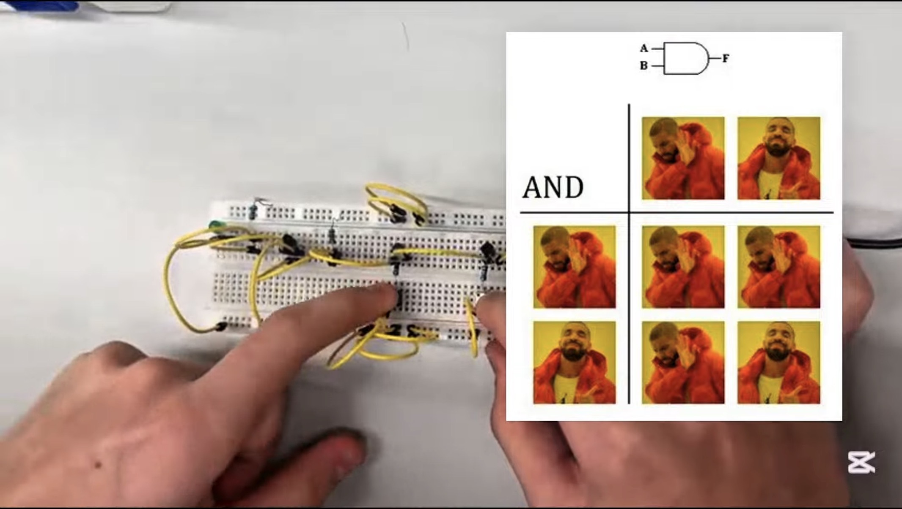
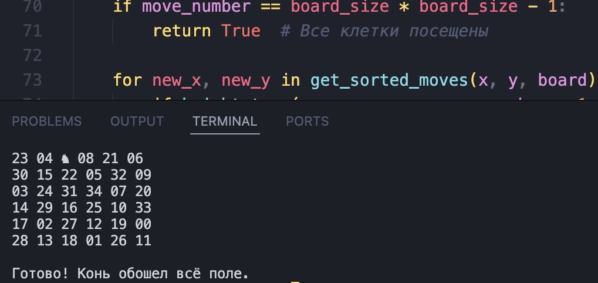

<html lang="en">
<head>
    <meta charset="UTF-8">
    <meta name="viewport" content="width=device-width, initial-scale=1.0">
    <title>Projects</title>
    <link rel="stylesheet" href="styles.css">
    <link rel="stylesheet" href="https://cdnjs.cloudflare.com/ajax/libs/font-awesome/6.4.0/css/all.min.css">
</head>
<body>
    <!-- Navigation Bar -->
    <nav class="navbar">
        

            

                <i class="fas fa-satellite"></i> My Portfolio
            

            <ul class="nav-menu">
                <li class="nav-item"><a href="index.html" class="nav-link">Home</a></li>
                <li class="nav-item"><a href="about.html" class="nav-link">About</a></li>
                <li class="nav-item"><a href="projects.html" class="nav-link active">Projects</a></li>
                <li class="nav-item"><a href="resume.html" class="nav-link">Resume</a></li>
            </ul>
            

                
                
                
            

        

    </nav>
    <!-- Projects Page Content -->
    <main>
        <section class="page-header">
            <h1>My Projects</h1>
            
Real Work. Real Impact.

        </section>
        <section class="projects-section">
            

                <!-- Project 1 -->
                

                    

                        
                    

                    

                        <h2>Project 1: Building Logic Gates</h2>
                        

                            Collaborated with team members to build basic logic gates on a breadboard, 
                            including AND, NAND, OR, and NOT gates, gaining practical understanding of 
                            digital electronics and circuit design. Although we did not physically 
                            build the XOR gate, we fully understood its concept. The project allowed 
                            us to apply problem-solving and teamwork skills while assembling and testing 
                            the circuits using breadboards, resistors, wires, and LEDs.
                        

                        

                            <a href="https://youtu.be/QctsqYZTqME" class="link-btn" target="_blank" rel="noopener noreferrer">
                                <i class="fas fa-external-link-alt"></i> Live Demo
                            </a>
                        

                    

                

                <!-- Project 2 -->
                

                    

                        
                    

                    

                        <h2>Project 2: Hour of Code Project</h2>
                        

                            Organized and led an Hour of Code event at School No.318, engaging students in hands-on 
                            programming activities. Collaborated with team members to introduce coding concepts in a fun 
                            and interactive way, helping participants understand the basics of programming. We also prepared 
                            gifts and certificates for attendees, making the event more memorable and rewarding. 
                            The workshop was well-received by students, and it addressed a real need in the community by 
                            sparking interest in technology and computer science.
                        

                        

                            <a href="https://youtu.be/Nmam1jtil6I" class="link-btn" target="_blank" rel="noopener noreferrer">
                                <i class="fas fa-external-link-alt"></i> Live Demo
                            </a>
                        

                    

                

                <!-- Additional Projects Grid -->
                <h2 class="section-title" style="margin-top: 60px;">Other Work</h2>
                

                    

                        

                            
                        

                        <h3>Project 3: Chess Knight</h3>
                        
Developed a Python program that generates a chessboard(6x6) and allows 
                            the user to choose the starting position of a knight. Implemented an algorithm to find a valid 
                            path in which the knight visits every square exactly once (Knight's Tour problem). The program 
                            visually draws the chessboard, tracks each move, and displays the total number of steps taken to 
                            complete the tour, demonstrating strong understanding of algorithms, recursion/backtracking, and 
                            problem-solving.

                        

                            Python
                        

                    

                    

                        

                            
                        

                        <h3>Project 4: Coming soon...</h3>
                    

                

            

        </section>
    </main>
    <!-- Footer -->
    <footer class="footer">
        

            

                <h4>Connect</h4>
                

                    <a href="https://github.com/mehdi-hnv" target="_blank" title="Github">
                        <i class="fab fa-github"></i>
                    </a>
                    <a href="https://www.codecademy.com/profiles/mehdi.hnv" target="_blank" title="Codecademy">
                        <i class="fas fa-code"></i>
                    </a>
                

            

            

                <h4>Repository</h4>
                

                    <a href="https://github.com/mehdi-hnv/portfolio" target="_blank" class="repo-link">
                        <i class="fab fa-github"></i> View Source
                    </a>
                

            

        

        

            
&copy; 2025 Mehdi Hasanov. Built with the help of AI and attitude.

        

    </footer>
    
</body>
</html>
